# NovaGuard System Architecture

## 🏗️ Overview

NovaGuard is built as a modern, scalable, and secure Web3 smart contract auditing platform. The architecture follows microservices principles with event-driven communication, ensuring high availability, performance, and maintainability.

## 📋 Table of Contents

- [High-Level Architecture](#high-level-architecture)
- [Frontend Architecture](#frontend-architecture)
- [Backend Services](#backend-services)
- [Database Design](#database-design)
- [Security Architecture](#security-architecture)
- [Deployment Architecture](#deployment-architecture)
- [Monitoring & Observability](#monitoring--observability)
- [Scalability & Performance](#scalability--performance)

## 🌐 High-Level Architecture



```mermaid
graph TB
    subgraph "Client Layer"
        WEB[Web Application]
        MOBILE[Mobile App]
        CLI[CLI Tool]
        SDK[SDKs]
    end
    
    subgraph "API Gateway"
        GATEWAY[API Gateway]
        AUTH[Authentication]
        RATE[Rate Limiting]
        CACHE[Response Cache]
    end
    
    subgraph "Core Services"
        ANALYSIS[Analysis Service]
        DEPLOY[Deployment Service]
        MONITOR[Monitoring Service]
        COLLAB[Collaboration Service]
        NOTIFY[Notification Service]
    end
    
    subgraph "AI/ML Layer"
        AIENGINE[AI Analysis Engine]
        MLMODELS[ML Models]
        TRAINING[Model Training]
    end
    
    subgraph "Blockchain Layer"
        ETHEREUM[Ethereum]
        POLYGON[Polygon]
        ARBITRUM[Arbitrum]
        OPTIMISM[Optimism]
        OTHER[Other Chains]
    end
    
    subgraph "Data Layer"
        POSTGRES[(PostgreSQL)]
        REDIS[(Redis)]
        S3[(Object Storage)]
        ELASTIC[(Elasticsearch)]
    end
    
    subgraph "External Services"
        IPFS[IPFS]
        ETHERSCAN[Block Explorers]
        PRICING[Price APIs]
        EMAIL[Email Service]
    end
    
    WEB --> GATEWAY
    MOBILE --> GATEWAY
    CLI --> GATEWAY
    SDK --> GATEWAY
    
    GATEWAY --> AUTH
    GATEWAY --> RATE
    GATEWAY --> CACHE
    
    GATEWAY --> ANALYSIS
    GATEWAY --> DEPLOY
    GATEWAY --> MONITOR
    GATEWAY --> COLLAB
    GATEWAY --> NOTIFY
    
    ANALYSIS --> AIENGINE
    AIENGINE --> MLMODELS
    
    DEPLOY --> ETHEREUM
    DEPLOY --> POLYGON
    DEPLOY --> ARBITRUM
    DEPLOY --> OPTIMISM
    DEPLOY --> OTHER
    
    MONITOR --> ETHEREUM
    MONITOR --> POLYGON
    MONITOR --> ARBITRUM
    MONITOR --> OPTIMISM
    
    ANALYSIS --> POSTGRES
    DEPLOY --> POSTGRES
    MONITOR --> POSTGRES
    COLLAB --> POSTGRES
    
    ANALYSIS --> REDIS
    DEPLOY --> REDIS
    MONITOR --> REDIS
    
    ANALYSIS --> S3
    DEPLOY --> S3
    
    MONITOR --> ELASTIC
    
    DEPLOY --> ETHERSCAN
    MONITOR --> PRICING
    NOTIFY --> EMAIL
```

## 💻 Frontend Architecture

### Technology Stack

- **Framework**: Next.js 14 with App Router
- **Language**: TypeScript with strict type checking
- **Styling**: Tailwind CSS with custom design system
- **UI Components**: Radix UI + shadcn/ui
- **State Management**: Zustand + React Query
- **Code Editor**: Monaco Editor with Solidity syntax
- **Real-time**: WebSocket connections
- **Authentication**: Clerk.js
- **Deployment**: Vercel with CDN

### Component Architecture

```typescript
// Component hierarchy
src/
├── app/                    # Next.js App Router
│   ├── (auth)/            # Authentication routes
│   ├── (dashboard)/       # Dashboard routes
│   ├── api/               # API routes
│   └── layout.tsx         # Root layout
├── components/
│   ├── ui/                # Base UI components
│   ├── advanced/          # Feature components
│   ├── layout/            # Layout components
│   └── providers/         # Context providers
├── lib/
│   ├── api.ts            # API client
│   ├── auth.ts           # Authentication
│   ├── utils.ts          # Utilities
│   └── validations.ts    # Zod schemas
├── hooks/                 # Custom React hooks
├── store/                 # Zustand stores
├── types/                 # TypeScript types
└── styles/               # Global styles
```

### State Management

```typescript
// Zustand store example
interface AppStore {
  // UI State
  theme: 'light' | 'dark' | 'system'
  sidebarOpen: boolean
  
  // User State
  user: User | null
  subscription: Subscription | null
  
  // Project State
  currentProject: Project | null
  projects: Project[]
  
  // Analysis State
  currentAnalysis: AnalysisResult | null
  analysisHistory: AnalysisResult[]
  
  // Actions
  setTheme: (theme: string) => void
  toggleSidebar: () => void
  setCurrentProject: (project: Project) => void
  addAnalysis: (analysis: AnalysisResult) => void
}

const useAppStore = create<AppStore>((set, get) => ({
  // Initial state
  theme: 'dark',
  sidebarOpen: true,
  user: null,
  subscription: null,
  currentProject: null,
  projects: [],
  currentAnalysis: null,
  analysisHistory: [],
  
  // Actions
  setTheme: (theme) => set({ theme }),
  toggleSidebar: () => set({ sidebarOpen: !get().sidebarOpen }),
  setCurrentProject: (project) => set({ currentProject: project }),
  addAnalysis: (analysis) => set({ 
    currentAnalysis: analysis,
    analysisHistory: [analysis, ...get().analysisHistory]
  })
}))
```

## 🔧 Backend Services

### Microservices Architecture

#### 1. API Gateway Service

```typescript
// Express.js with TypeScript
interface GatewayConfig {
  port: number
  cors: CorsOptions
  rateLimit: RateLimitConfig
  authentication: AuthConfig
}

class APIGateway {
  private app: Express
  private services: Map<string, ServiceConfig>
  
  constructor(config: GatewayConfig) {
    this.app = express()
    this.setupMiddleware(config)
    this.setupRoutes()
  }
  
  private setupMiddleware(config: GatewayConfig) {
    // CORS
    this.app.use(cors(config.cors))
    
    // Rate limiting
    this.app.use(rateLimit(config.rateLimit))
    
    // Authentication
    this.app.use('/api', authenticateToken)
    
    // Request logging
    this.app.use(morgan('combined'))
    
    // Error handling
    this.app.use(errorHandler)
  }
  
  private setupRoutes() {
    // Health check
    this.app.get('/health', healthCheck)
    
    // Service routing
    this.app.use('/api/v1/analysis', proxyTo('analysis-service'))
    this.app.use('/api/v1/deployment', proxyTo('deployment-service'))
    this.app.use('/api/v1/monitoring', proxyTo('monitoring-service'))
    this.app.use('/api/v1/collaboration', proxyTo('collaboration-service'))
  }
}
```

#### 2. Analysis Service

```typescript
// Analysis service with AI integration
interface AnalysisRequest {
  projectId: string
  contractCode: string
  config: AnalysisConfig
}

class AnalysisService {
  private aiEngine: AIAnalysisEngine
  private database: Database
  private queue: Queue
  
  async analyzeContract(request: AnalysisRequest): Promise<AnalysisResult> {
    // Validate input
    const validation = await this.validateContract(request.contractCode)
    if (!validation.isValid) {
      throw new ValidationError(validation.errors)
    }
    
    // Queue analysis job
    const job = await this.queue.add('analyze', {
      projectId: request.projectId,
      contractCode: request.contractCode,
      config: request.config
    }, {
      priority: this.getPriority(request.config),
      attempts: 3,
      backoff: 'exponential'
    })
    
    return { jobId: job.id, status: 'queued' }
  }
  
  async processAnalysis(job: Job): Promise<void> {
    const { projectId, contractCode, config } = job.data
    
    try {
      // Update status
      await this.updateAnalysisStatus(projectId, 'processing')
      
      // Run AI analysis
      const aiResult = await this.aiEngine.analyze(contractCode, config)
      
      // Run static analysis
      const staticResult = await this.runStaticAnalysis(contractCode, config)
      
      // Combine results
      const result = this.combineResults(aiResult, staticResult)
      
      // Save to database
      await this.saveAnalysisResult(projectId, result)
      
      // Send notification
      await this.notifyCompletion(projectId, result)
      
    } catch (error) {
      await this.handleAnalysisError(projectId, error)
    }
  }
}
```

#### 3. Deployment Service

```typescript
// Multi-chain deployment service
interface DeploymentRequest {
  projectId: string
  networkId: string
  contractBytecode: string
  constructorArgs: any[]
  config: DeploymentConfig
}

class DeploymentService {
  private providers: Map<string, ethers.Provider>
  private wallets: Map<string, ethers.Wallet>
  
  async deployContract(request: DeploymentRequest): Promise<Deployment> {
    const network = await this.getNetwork(request.networkId)
    const provider = this.providers.get(request.networkId)
    const wallet = this.wallets.get(request.networkId)
    
    // Estimate gas
    const gasEstimate = await this.estimateGas(request, provider)
    
    // Check balance
    await this.checkBalance(wallet, gasEstimate, network)
    
    // Deploy contract
    const factory = new ethers.ContractFactory(
      request.contractBytecode,
      request.constructorArgs,
      wallet
    )
    
    const contract = await factory.deploy(...request.constructorArgs, {
      gasLimit: gasEstimate.gasLimit,
      gasPrice: gasEstimate.gasPrice,
      maxFeePerGas: gasEstimate.maxFeePerGas,
      maxPriorityFeePerGas: gasEstimate.maxPriorityFeePerGas
    })
    
    // Wait for deployment
    await contract.deployed()
    
    // Verify contract
    if (request.config.verification) {
      await this.verifyContract(contract.address, request)
    }
    
    // Enable monitoring
    if (request.config.monitoring) {
      await this.enableMonitoring(contract.address, request.networkId)
    }
    
    return {
      id: generateId(),
      projectId: request.projectId,
      networkId: request.networkId,
      contractAddress: contract.address,
      transactionHash: contract.deployTransaction.hash,
      status: 'deployed',
      gasUsed: contract.deployTransaction.gasLimit,
      deploymentCost: this.calculateCost(contract.deployTransaction)
    }
  }
}
```

#### 4. Monitoring Service

```typescript
// Real-time contract monitoring
class MonitoringService {
  private providers: Map<string, ethers.Provider>
  private alertEngine: AlertEngine
  private metricsCollector: MetricsCollector
  
  async enableMonitoring(contractAddress: string, networkId: string): Promise<void> {
    const provider = this.providers.get(networkId)
    
    // Set up event listeners
    const contract = new ethers.Contract(contractAddress, ABI, provider)
    
    // Monitor all events
    contract.on('*', (event) => {
      this.processEvent(contractAddress, networkId, event)
    })
    
    // Monitor transactions
    provider.on('block', async (blockNumber) => {
      await this.checkBlockTransactions(contractAddress, blockNumber)
    })
    
    // Periodic health checks
    setInterval(() => {
      this.performHealthCheck(contractAddress, networkId)
    }, 60000) // Every minute
  }
  
  private async processEvent(
    contractAddress: string, 
    networkId: string, 
    event: Event
  ): Promise<void> {
    // Collect metrics
    await this.metricsCollector.recordEvent(contractAddress, event)
    
    // Check for alerts
    const alerts = await this.alertEngine.checkEvent(event)
    
    if (alerts.length > 0) {
      await this.sendAlerts(contractAddress, alerts)
    }
  }
}
```

## 🗄️ Database Design

### PostgreSQL Schema

```sql
-- Users and Authentication
CREATE TABLE users (
    id UUID PRIMARY KEY DEFAULT gen_random_uuid(),
    email VARCHAR(255) UNIQUE NOT NULL,
    name VARCHAR(255) NOT NULL,
    avatar_url TEXT,
    plan VARCHAR(50) DEFAULT 'free',
    credits INTEGER DEFAULT 0,
    created_at TIMESTAMP DEFAULT NOW(),
    updated_at TIMESTAMP DEFAULT NOW()
);

-- Projects
CREATE TABLE projects (
    id UUID PRIMARY KEY DEFAULT gen_random_uuid(),
    user_id UUID REFERENCES users(id) ON DELETE CASCADE,
    name VARCHAR(255) NOT NULL,
    description TEXT,
    contract_code TEXT NOT NULL,
    language VARCHAR(50) DEFAULT 'solidity',
    is_public BOOLEAN DEFAULT false,
    tags TEXT[],
    created_at TIMESTAMP DEFAULT NOW(),
    updated_at TIMESTAMP DEFAULT NOW()
);

-- Analysis Results
CREATE TABLE analysis_results (
    id UUID PRIMARY KEY DEFAULT gen_random_uuid(),
    project_id UUID REFERENCES projects(id) ON DELETE CASCADE,
    security_score INTEGER NOT NULL,
    gas_score INTEGER NOT NULL,
    overall_score INTEGER NOT NULL,
    vulnerabilities JSONB NOT NULL DEFAULT '[]',
    gas_optimizations JSONB NOT NULL DEFAULT '[]',
    recommendations JSONB NOT NULL DEFAULT '[]',
    metadata JSONB NOT NULL DEFAULT '{}',
    created_at TIMESTAMP DEFAULT NOW()
);

-- Deployments
CREATE TABLE deployments (
    id UUID PRIMARY KEY DEFAULT gen_random_uuid(),
    project_id UUID REFERENCES projects(id) ON DELETE CASCADE,
    network_id VARCHAR(50) NOT NULL,
    contract_address VARCHAR(42),
    transaction_hash VARCHAR(66),
    gas_used BIGINT,
    gas_price BIGINT,
    deployment_cost DECIMAL(20, 8),
    status VARCHAR(50) DEFAULT 'pending',
    error_message TEXT,
    created_at TIMESTAMP DEFAULT NOW(),
    updated_at TIMESTAMP DEFAULT NOW()
);

-- Monitoring
CREATE TABLE contract_monitoring (
    id UUID PRIMARY KEY DEFAULT gen_random_uuid(),
    deployment_id UUID REFERENCES deployments(id) ON DELETE CASCADE,
    is_active BOOLEAN DEFAULT true,
    alert_config JSONB NOT NULL DEFAULT '{}',
    last_checked TIMESTAMP DEFAULT NOW(),
    created_at TIMESTAMP DEFAULT NOW()
);

-- Alerts
CREATE TABLE alerts (
    id UUID PRIMARY KEY DEFAULT gen_random_uuid(),
    monitoring_id UUID REFERENCES contract_monitoring(id) ON DELETE CASCADE,
    type VARCHAR(50) NOT NULL,
    severity VARCHAR(20) NOT NULL,
    title VARCHAR(255) NOT NULL,
    description TEXT NOT NULL,
    metadata JSONB DEFAULT '{}',
    is_read BOOLEAN DEFAULT false,
    created_at TIMESTAMP DEFAULT NOW()
);

-- Teams and Collaboration
CREATE TABLE teams (
    id UUID PRIMARY KEY DEFAULT gen_random_uuid(),
    name VARCHAR(255) NOT NULL,
    description TEXT,
    owner_id UUID REFERENCES users(id) ON DELETE CASCADE,
    plan VARCHAR(50) DEFAULT 'free',
    created_at TIMESTAMP DEFAULT NOW()
);

CREATE TABLE team_members (
    id UUID PRIMARY KEY DEFAULT gen_random_uuid(),
    team_id UUID REFERENCES teams(id) ON DELETE CASCADE,
    user_id UUID REFERENCES users(id) ON DELETE CASCADE,
    role VARCHAR(50) DEFAULT 'member',
    permissions JSONB DEFAULT '{}',
    joined_at TIMESTAMP DEFAULT NOW(),
    UNIQUE(team_id, user_id)
);

-- Indexes for performance
CREATE INDEX idx_projects_user_id ON projects(user_id);
CREATE INDEX idx_analysis_results_project_id ON analysis_results(project_id);
CREATE INDEX idx_deployments_project_id ON deployments(project_id);
CREATE INDEX idx_deployments_network_id ON deployments(network_id);
CREATE INDEX idx_alerts_monitoring_id ON alerts(monitoring_id);
CREATE INDEX idx_alerts_created_at ON alerts(created_at);
CREATE INDEX idx_team_members_team_id ON team_members(team_id);
CREATE INDEX idx_team_members_user_id ON team_members(user_id);
```

### Redis Cache Strategy

```typescript
// Redis caching patterns
class CacheService {
  private redis: Redis
  
  // Analysis result caching
  async cacheAnalysisResult(projectId: string, result: AnalysisResult): Promise<void> {
    const key = `analysis:${projectId}:${result.id}`
    await this.redis.setex(key, 3600, JSON.stringify(result)) // 1 hour TTL
  }
  
  // Gas price caching
  async cacheGasPrice(networkId: string, gasData: GasData): Promise<void> {
    const key = `gas:${networkId}`
    await this.redis.setex(key, 60, JSON.stringify(gasData)) // 1 minute TTL
  }
  
  // User session caching
  async cacheUserSession(userId: string, session: UserSession): Promise<void> {
    const key = `session:${userId}`
    await this.redis.setex(key, 86400, JSON.stringify(session)) // 24 hours TTL
  }
  
  // Rate limiting
  async checkRateLimit(userId: string, endpoint: string): Promise<boolean> {
    const key = `ratelimit:${userId}:${endpoint}`
    const current = await this.redis.incr(key)
    
    if (current === 1) {
      await this.redis.expire(key, 3600) // 1 hour window
    }
    
    return current <= this.getRateLimit(endpoint)
  }
}
```

## 🔒 Security Architecture

### Authentication & Authorization

```typescript
// JWT-based authentication with role-based access control
interface JWTPayload {
  userId: string
  email: string
  role: string
  permissions: string[]
  teamId?: string
  exp: number
  iat: number
}

class AuthService {
  private jwtSecret: string
  private refreshSecret: string
  
  async generateTokens(user: User): Promise<TokenPair> {
    const payload: JWTPayload = {
      userId: user.id,
      email: user.email,
      role: user.role,
      permissions: user.permissions,
      teamId: user.teamId,
      exp: Math.floor(Date.now() / 1000) + 3600, // 1 hour
      iat: Math.floor(Date.now() / 1000)
    }
    
    const accessToken = jwt.sign(payload, this.jwtSecret)
    const refreshToken = jwt.sign(
      { userId: user.id },
      this.refreshSecret,
      { expiresIn: '7d' }
    )
    
    return { accessToken, refreshToken }
  }
  
  async verifyToken(token: string): Promise<JWTPayload> {
    try {
      return jwt.verify(token, this.jwtSecret) as JWTPayload
    } catch (error) {
      throw new UnauthorizedError('Invalid token')
    }
  }
}

// Permission-based middleware
const requirePermission = (permission: string) => {
  return (req: Request, res: Response, next: NextFunction) => {
    const user = req.user as JWTPayload
    
    if (!user.permissions.includes(permission)) {
      return res.status(403).json({ error: 'Insufficient permissions' })
    }
    
    next()
  }
}
```

### Data Encryption

```typescript
// Encryption service for sensitive data
class EncryptionService {
  private algorithm = 'aes-256-gcm'
  private key: Buffer
  
  encrypt(text: string): EncryptedData {
    const iv = crypto.randomBytes(16)
    const cipher = crypto.createCipher(this.algorithm, this.key)
    cipher.setAAD(Buffer.from('NovaGuard', 'utf8'))
    
    let encrypted = cipher.update(text, 'utf8', 'hex')
    encrypted += cipher.final('hex')
    
    const authTag = cipher.getAuthTag()
    
    return {
      encrypted,
      iv: iv.toString('hex'),
      authTag: authTag.toString('hex')
    }
  }
  
  decrypt(data: EncryptedData): string {
    const decipher = crypto.createDecipher(this.algorithm, this.key)
    decipher.setAAD(Buffer.from('NovaGuard', 'utf8'))
    decipher.setAuthTag(Buffer.from(data.authTag, 'hex'))
    
    let decrypted = decipher.update(data.encrypted, 'hex', 'utf8')
    decrypted += decipher.final('utf8')
    
    return decrypted
  }
}
```

## 🚀 Deployment Architecture

### Kubernetes Configuration

```yaml
# API Gateway Deployment
apiVersion: apps/v1
kind: Deployment
metadata:
  name: api-gateway
spec:
  replicas: 3
  selector:
    matchLabels:
      app: api-gateway
  template:
    metadata:
      labels:
        app: api-gateway
    spec:
      containers:
      - name: api-gateway
        image: novaguard/api-gateway:latest
        ports:
        - containerPort: 3000
        env:
        - name: NODE_ENV
          value: "production"
        - name: DATABASE_URL
          valueFrom:
            secretKeyRef:
              name: database-secret
              key: url
        resources:
          requests:
            memory: "256Mi"
            cpu: "250m"
          limits:
            memory: "512Mi"
            cpu: "500m"
        livenessProbe:
          httpGet:
            path: /health
            port: 3000
          initialDelaySeconds: 30
          periodSeconds: 10
        readinessProbe:
          httpGet:
            path: /ready
            port: 3000
          initialDelaySeconds: 5
          periodSeconds: 5

---
# Service
apiVersion: v1
kind: Service
metadata:
  name: api-gateway-service
spec:
  selector:
    app: api-gateway
  ports:
  - port: 80
    targetPort: 3000
  type: LoadBalancer
```

### Docker Configuration

```dockerfile
# Multi-stage build for API Gateway
FROM node:18-alpine AS builder

WORKDIR /app
COPY package*.json ./
RUN npm ci --only=production

COPY . .
RUN npm run build

FROM node:18-alpine AS runner

WORKDIR /app

# Create non-root user
RUN addgroup --system --gid 1001 nodejs
RUN adduser --system --uid 1001 nextjs

# Copy built application
COPY --from=builder /app/dist ./dist
COPY --from=builder /app/node_modules ./node_modules
COPY --from=builder /app/package.json ./package.json

USER nextjs

EXPOSE 3000

ENV NODE_ENV=production

CMD ["npm", "start"]
```

## 📊 Monitoring & Observability

### Metrics Collection

```typescript
// Prometheus metrics
import { register, Counter, Histogram, Gauge } from 'prom-client'

class MetricsService {
  private httpRequestsTotal = new Counter({
    name: 'http_requests_total',
    help: 'Total number of HTTP requests',
    labelNames: ['method', 'route', 'status_code']
  })
  
  private httpRequestDuration = new Histogram({
    name: 'http_request_duration_seconds',
    help: 'Duration of HTTP requests in seconds',
    labelNames: ['method', 'route'],
    buckets: [0.1, 0.5, 1, 2, 5]
  })
  
  private analysisJobsActive = new Gauge({
    name: 'analysis_jobs_active',
    help: 'Number of active analysis jobs'
  })
  
  recordHttpRequest(method: string, route: string, statusCode: number, duration: number) {
    this.httpRequestsTotal.inc({ method, route, status_code: statusCode })
    this.httpRequestDuration.observe({ method, route }, duration)
  }
  
  setActiveAnalysisJobs(count: number) {
    this.analysisJobsActive.set(count)
  }
}
```

### Logging Strategy

```typescript
// Structured logging with Winston
import winston from 'winston'

const logger = winston.createLogger({
  level: 'info',
  format: winston.format.combine(
    winston.format.timestamp(),
    winston.format.errors({ stack: true }),
    winston.format.json()
  ),
  defaultMeta: { service: 'novaguard-api' },
  transports: [
    new winston.transports.File({ filename: 'error.log', level: 'error' }),
    new winston.transports.File({ filename: 'combined.log' }),
    new winston.transports.Console({
      format: winston.format.simple()
    })
  ]
})

// Usage
logger.info('Analysis started', {
  projectId: 'proj_123',
  userId: 'user_456',
  analysisType: 'comprehensive'
})

logger.error('Deployment failed', {
  projectId: 'proj_123',
  networkId: 'ethereum',
  error: error.message,
  stack: error.stack
})
```

---

**Architecture Version**: v1.0  
**Last Updated**: January 2024  
**Review Cycle**: Quarterly
